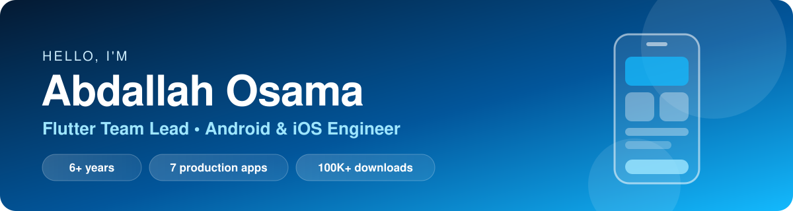

<!-- Header -->
<p align="center">
  
</p>

<p align="center">
  <a href="https://www.linkedin.com/in/abdallahkddah/"></a>
  <a href="mailto:abdallah.kddah97@gmail.com"></a>
  <a href="https://gitlab.com/ao25332"></a>
</p>

<br/>

## 👋 Hey there

I turn product ideas into polished **Android & iOS** apps — from the first widget to the store release.
For 6+ years I've been shipping Flutter apps across marketplaces, education, fintech, services and social platforms, and today I lead the Flutter team at **Alalmiya Alhura**.

```dart
class Abdallah extends Developer {
  final role      = 'Flutter Team Lead';
  final base      = 'Mansoura, Egypt 🇪🇬';
  final shipping  = ['Android', 'iOS', 'Huawei AppGallery'];
  final loves     = ['Clean architecture', 'Smooth UX', 'Hard bugs'];
  final superpower = 'Dropping into Kotlin / Swift when Flutter isn\'t enough';
}
```

<br/>

## 📱 Apps I've Built

<table>
  <tr>
    <td align="center" width="25%">
      <br/>
      <b>Welp</b><br/>
      <sub>Discover places, order & book — powered by real reviews</sub><br/><br/>
      <br/>
      <a href="https://play.google.com/store/apps/details?id=com.welp.welp"></a>
      <a href="https://apps.apple.com/us/app/welp-rating-social-reviews/id6478454000"></a>
    </td>
    <td align="center" width="25%">
      <br/>
      <b>A Plus</b><br/>
      <sub>Courses, lectures & a study library for university students</sub><br/><br/>
      <br/>
      <a href="https://play.google.com/store/apps/details?id=com.sellx.aplus_student"></a>
      <a href="https://apps.apple.com/eg/app/a-plus/id1543956025"></a>
    </td>
    <td align="center" width="25%">
      <br/>
      <b>Jinni Services</b><br/>
      <sub>Home & business cleaning, booked in a few taps</sub><br/><br/>
      <br/>
      <a href="https://play.google.com/store/search?q=jinni%20services&c=apps"></a>
      <a href="https://apps.apple.com/us/app/jinni-services/id1450754451"></a>
    </td>
    <td align="center" width="25%">
      <br/>
      <b>EduCash</b><br/>
      <sub>Tuition financing & installments with partner schools</sub><br/><br/>
      <br/>
      <a href="https://play.google.com/store/apps/details?id=com.alalmia.alhura.educash"></a>
      <a href="https://apps.apple.com/us/app/edu-cash/id6451444229"></a>
    </td>
  </tr>
  <tr>
    <td align="center" width="25%">
      <br/>
      <b>All In</b><br/>
      <sub>Buy, sell, rent & request — with nearby discovery and chat</sub><br/><br/>
      <br/>
      <a href="https://play.google.com/store/apps/details?id=com.alalmiyalhura.allin"></a>
      <a href="https://apps.apple.com/us/app/all-in-%D8%A8%D9%8A%D8%B9-%D9%88%D8%A7%D8%B4%D8%AA%D8%B1-%D8%A8%D8%AF%D9%88%D9%86-%D8%B9%D9%85%D9%88%D9%84%D8%A9/id6746713475"></a>
    </td>
    <td align="center" width="25%">
      <br/>
      <b>Jinni Provider</b><br/>
      <sub>Shifts, tasks & performance for service teams</sub><br/><br/>
      <br/>
      <a href="https://play.google.com/store/apps/details?id=com.jinni.providerapp"></a>
      <a href="https://apps.apple.com/us/app/%D8%AE%D8%AF%D9%85%D8%A7%D8%AA-%D8%AC%D9%8A%D9%86%D9%8A/id1624575852"></a>
    </td>
    <td align="center" width="25%">
      <br/>
      <b>Zeda</b><br/>
      <sub>Collect points, scan QR coupons & redeem rewards</sub><br/><br/>
      <br/>
      <a href="https://play.google.com/store/apps/details?id=cloud.alalmiyaalhura.zeda&hl=en"></a>
      <a href="https://apps.apple.com/us/app/zeda/id6758104605"></a>
    </td>
    <td align="center" width="25%">
      <br/><br/>
      <b>Your app next? 🚀</b><br/>
      <sub>Let's build something great together</sub><br/><br/>
      <a href="mailto:abdallah.kddah97@gmail.com"></a>
    </td>
  </tr>
</table>

<br/>

## ⚡ What I'm Great At

<table>
  <tr>
    <td width="50%" valign="top">
      <h4>🔔 Notifications that just work</h4>
      Foreground, background, terminated — payload routing and deep navigation on both platforms.
    </td>
    <td width="50%" valign="top">
      <h4>📍 Real-time & location</h4>
      Live tracking with Google Maps, Socket.IO, and background tracking even when the app is closed.
    </td>
  </tr>
  <tr>
    <td width="50%" valign="top">
      <h4>🧩 Flutter ↔ Native</h4>
      Platform Channels, native SDKs and permissions in Kotlin & Swift whenever the product needs it.
    </td>
    <td width="50%" valign="top">
      <h4>🏗️ Scalable foundations</h4>
      Clean architecture with BLoC, Provider & GetX, reusable project templates, and a team that ships.
    </td>
  </tr>
</table>

<br/>

## 🛠️ Toolbox

<p align="center">
  
</p>

<br/>

## 📊 GitHub Activity

<p align="center">
  
  
</p>

<!-- Footer -->
<p align="center">
  
</p>
